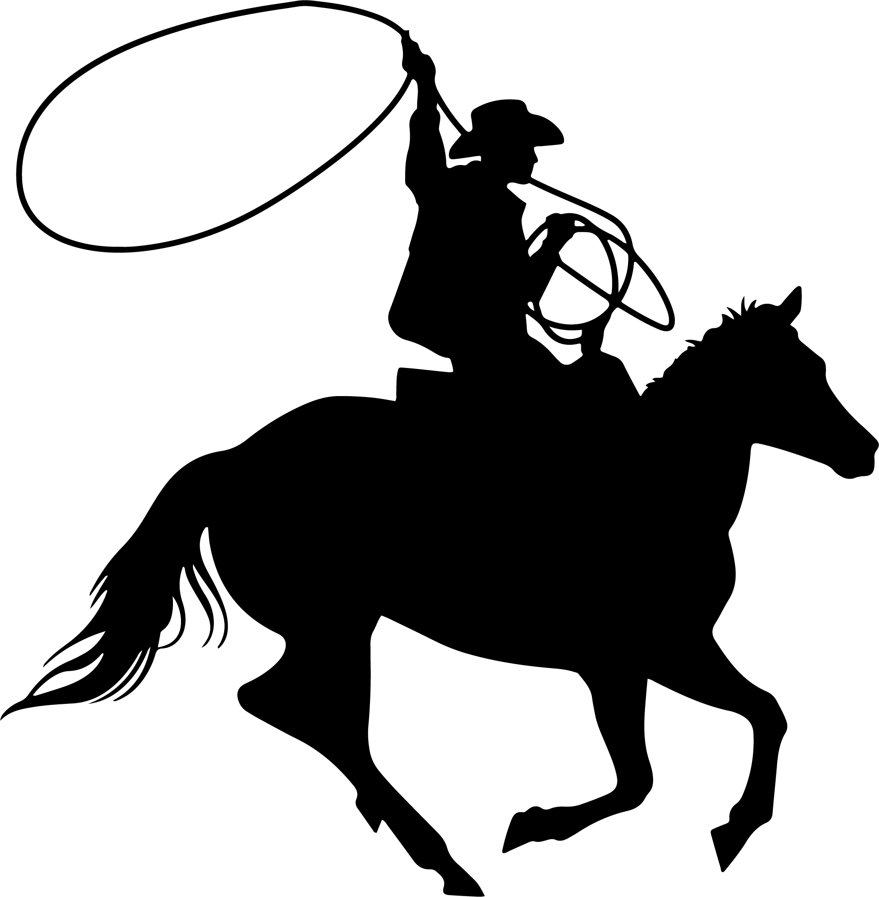

# 🌱 FarmerBasket - Fresh from Farm to Table

<div align="center">
  
  
  [](LICENSE)
  [](https://farmer-basket.vercel.app/)
</div>

## 🚀 About TheValleyCo & FarmerBasket

FarmerBasket, a subsidiary of TheValleyCo, is revolutionizing the way people access fresh, locally-grown produce. Our platform connects consumers directly with local farmers, ensuring the highest quality products while supporting sustainable agriculture.

### 🌟 Our Vision

At TheValleyCo, we envision a future where every community has access to fresh, locally-grown produce. We're building a sustainable food system that benefits both farmers and consumers, making farm-fresh produce accessible to everyone.

### 💡 Core Values

- **Sustainability**: Committed to eco-friendly farming practices
- **Quality**: Rigorous quality checks for all products
- **Community**: Building strong relationships with local farmers and consumers

## 🛍️ Features

- **Fresh Produce**: Direct from local farms to your table
- **Quality Assurance**: Rigorous quality checks for all products
- **Sustainable Practices**: Supporting eco-friendly farming
- **Local Support**: Helping local farmers thrive
- **Convenient Delivery**: Fast and reliable shipping

## 📱 Tech Stack

- **Frontend**: Next.js, React, TypeScript
- **Styling**: Tailwind CSS
- **Deployment**: Vercel
- **Maps**: Google Maps API
- **Font**: Fjalla One

## 🏗️ Project Structure

```
farmer-basket/
├── src/
│   ├── app/
│   │   ├── about/
│   │   ├── shop/
│   │   └── page.tsx
│   ├── components/
│   │   ├── Header.tsx
│   │   ├── FarmersMap.tsx
│   │   └── ProductSlideshow.tsx
│   └── styles/
│       └── globals.css
└── public/
    └── pictures/
```

## 🚀 Getting Started

1. Clone the repository:
   ```bash
   git clone https://github.com/yourusername/farmer-basket.git
   ```

2. Install dependencies:
   ```bash
   npm install
   ```

3. Create a `.env.local` file and add your environment variables:
   ```
   NEXT_PUBLIC_GOOGLE_MAPS_API_KEY=your_api_key_here
   ```

4. Run the development server:
   ```bash
   npm run dev
   ```

## 📞 Contact

- **Email**: srikarsistla710@gmail.com
- **Phone**: (443) 636-7777
- **Address**: 123 Farm Road, Green Valley, CA 90210

## 🤝 Contributing

We welcome contributions! Please feel free to submit a Pull Request.

## 📄 License

This project is licensed under the MIT License - see the [LICENSE](LICENSE) file for details.

---

<div align="center">
  <p>Made with ❤️ by TheValleyCo</p>
  <p>© 2025 FarmerBasket. All rights reserved.</p>
</div>
